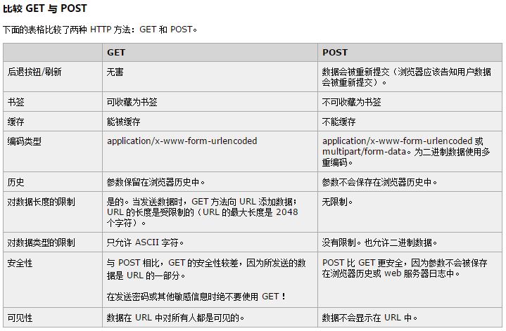
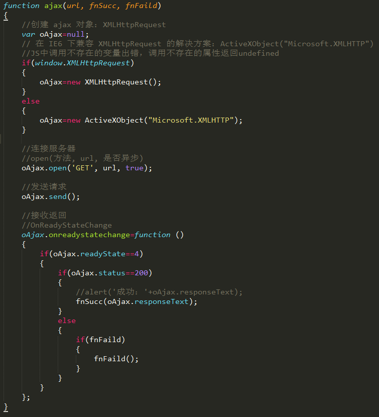
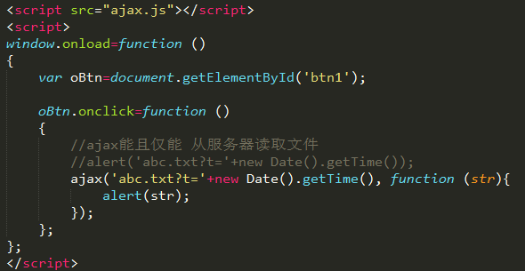
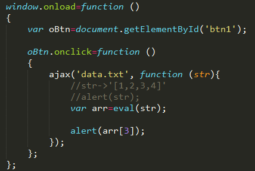
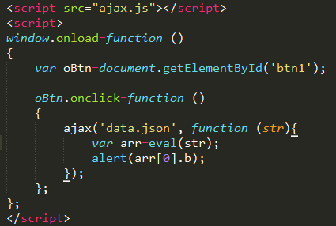
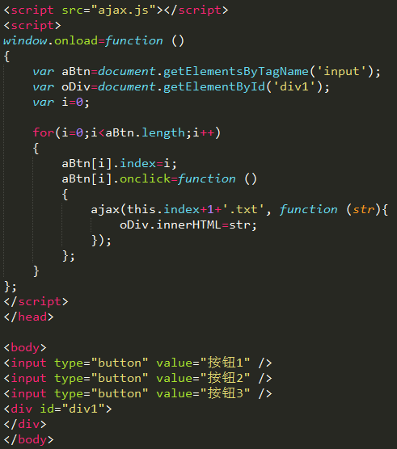
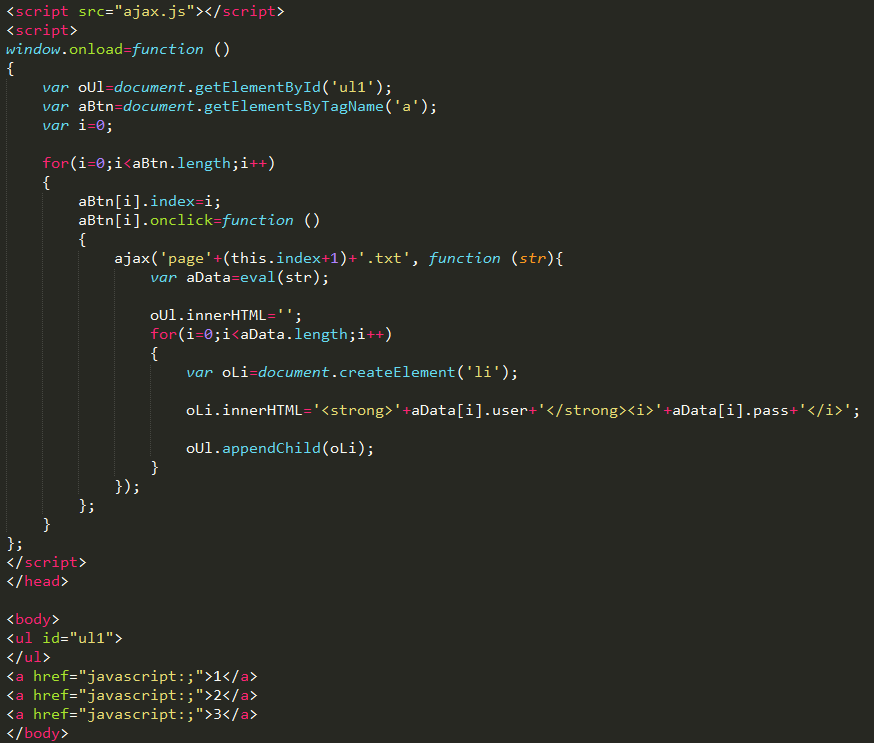

　　因个人知识有限，若发现文章中错误，欢迎发邮件与我进行讨论，邮箱：wangbin2014@hotmail.com，同时，欢迎关注[我的github账号](https://github.com/wangbin2015)                  　　        

***
　　在写上一篇关于cookie的文章的时候代码块缩进在网页中显示一直有问题，把代码删了再写还是有问题，无奈采用截图方式。用截图的方式一下子轻松了许多，在移动端代码也不会换行显示了，无心插柳，哈哈。

**1、什么是AJAX**     
AJAX全称为“Asynchronous JavaScript and XML”（异步JavaScript和XML），是一种创建交互式网页应用的网页开发技术。它使用：
* 使用XHTML+CSS来标准化呈现；
* 使用XML和XSLT进行数据交换及相关操作；
* 使用XMLHttpRequest对象与Web服务器进行异步数据通信； 
* 使用Javascript操作Document Object Model进行动态显示及交互； 
* 使用JavaScript绑定和处理所有数据    

**2、什么是 HTTP**       
* 超文本传输协议（HTTP）的设计目的是保证客户机与服务器之间的通信。     
* HTTP 的工作方式是客户机与服务器之间的请求-应答协议。     
* web 浏览器可能是客户端，而计算机上的网络应用程序也可能作为服务器端。       
* 举例：客户端（浏览器）向服务器提交 HTTP 请求；服务器向客户端返回响应。响应包含关于请求的状态信息以及可能被请求的内容。    

**3、AJAX 原理、http请求：GET \ POST，两种方式的区别**                 
Ajax的工作原理相当于在用户和服务器之间加了—个中间层(AJAX引擎),使用户操作与服务器响应异步化。并不是所有的用户请求都提交给服务器,像—些数据验证和数据处理等都交给Ajax引擎自己来做, 只有确定需要从服务器读取新数据时再由Ajax引擎代为向服务器提交请求。        

  

**4、Ajax用来监控请求的状态事件是什么？分几个阶段，如何获取返回值？**
* onreadystatechange事件    
* readyState属性：请求状态       
0（未初始化）还没有调用open()方法     
1（载入）已调用send()方法，正在发送请求     
2（载入完成）send()方法完成，已收到全部响应内容    
3（解析）正在解析响应内容     
4（完成）响应内容解析完成，可以在客户端调用了     
* status属性：请求结果
1xx：信息类，表示收到请求     
200：成功       
3xx：表示没成功，客户必须采取进一步动作     
404：客户端错误，未找到网页        
Found：请求中引用的文档不存在     
5xx：服务器错误     

**5、封装Ajax**       

  

**6、使用AJAX，读取服务器环境下文件的实例（读取文件时注意编码一致），并用 new Date().getTime() 方式消除缓存的影响**

    

**7、读取服务器文件中的数据全是字符串，用eval() 方法解析字符串**            

    

**8、读取数组里的json**            

**9、AJAX 分页实例，创建数据**     

**10、布局、ajax 读取、生成 li 元素，读取数据，预先清空数据**    

  
