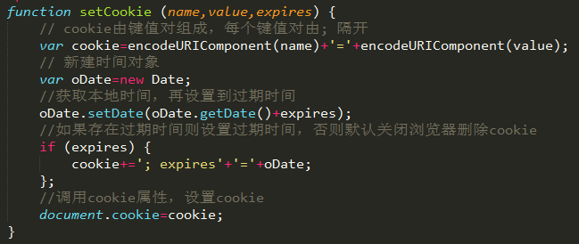

　　因个人知识有限，若发现文章中错误，欢迎发邮件与我进行讨论，邮箱：wangbin2014@hotmail.com，同时，欢迎关注[我的github账号](https://github.com/wangbin2015)                  　　        

***
　　算一算已经有些日子没有更新博客了，很大一部分原因是上一篇文章有些坑没填。        
　　这几天一直在做[《网易微专业》的主页面](https://github.com/wangbin2015/WYEDU)，在设计稿中，顶部有点击不再提醒的小黄条，此处应用cookie。        

### 一、什么是cookie及其特性

* 页面上用来保存信息     
比如：自动登录、记住用户名   
* cookie的特性    
1、同一个网站所有页面共享一套cookie    
2、数量大小有限     
3、有过期时间     
4、JS中通过document.cookie使用cookie    

### 二、cookie的使用    

#### 1、设置cookie    

#### 2、读取cookie      

#### 3、删除cookie         

     
