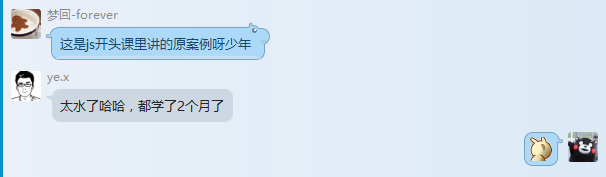

　　因个人知识有限，若发现文章中错误，欢迎发邮件与我进行讨论，邮箱：wangbin2014@hotmail.com，同时，欢迎关注[我的github账号](https://github.com/wangbin2015)      
　　今天的博文封面是2015年6月14日拍摄于小区附近的一条马路。    　　        

***
　　今天的学习很不愉快，可能是天气过于闷热看书很难投入，当然，对于不学习总有一百个理由在等着。今天本想写关于原型与继承的文章，无奈没有看完高程第六章的内容，很难想象一个月前当我第一次读到这里的时候是怎么坚持读完的。     
　　在讨论群里问了个问题Array.prototype.join.call(arguments,',');是什么意思，结果被鄙视了，放个截图检讨下自己，路漫漫其修远并不是说说而已。

　　

***

　　看了网上很多关于闭包的文章，唯有阮一峰的文章浅显易懂，本文大部分摘选于阮一峰 [《学习Javascript闭包（Closure）》](http://www.ruanyifeng.com/blog/2009/08/learning_javascript_closures.html)，感谢前人栽树。     
　　对JavaScript程序员来说，闭包是难懂又必须征服的概念，很多高级应用都要依靠闭包实现。闭包的形成与变量作用域以及变量的
生存周期密切相关。

### 一、变量的作用域

　　要理解闭包，首先必须理解Javascript特殊的变量作用域。变量的作用域，就是只变量的有效范围。       
　　变量的作用域无非就是两种：全局变量和局部变量。      
　　Javascript语言的特殊之处，就在于函数内部可以直接读取全局变量，在函数外部自然无法读取函数内的局部变量。这里有一个地方需要注意，函
数内部声明变量的时候，一定要使用var命令。如果不用的话，你实际上声明了一个全局变量！

    var func=function(){
        var a=1;
        return alert(a);
    }
    func();//1
    alert(a);//ReferenceError: a is not defined
   
　　下面这段包含了嵌套函数的代码，也许能帮助加深理解。

    var a=1;
    var func1=function(){
        var b=2;
        var func2=function(){
            var c=3;
            alert(a);//1
            alert(b);//2
        }
        func2();
        alert(c);/ReferenceError: a is not defined
    }　
    func1();
    
### 二、如何从外部读取局部变量

　　函数func2就被包括在函数func1内部，这时func1内部的所有局部变量，对func2都是可见的。但是反过来就不行，func2内部的局部变量，对func1就是不可见的。      
　　这就是Javascript语言特有的"链式作用域"结构（chain scope），子对象会一级一级地向上寻找所有父对象的变量。所以，父对象的所有变量，对子对象都是可见的，反之则不成立。此时的函数就像一层半透明的玻璃，在函数里面可以看到函数外面的变量，而在函数外面则无法看到函数里面的变量。          
　　既然func2可以读取func1中的局部变量，那么只要把func2作为返回值，我们不就可以在func1外部读取它的内部变量了吗？
    
    var a=1;
    var func=function(){
        var b=2;
        return (function(){
            var c=3;
            alert(a);//1
            alert(b);//2
        })()
        alert(c);//不执行
    }
    func();
    
### 三、闭包的概念
    
　　上一节代码中return里面函数，就是闭包。     
　　各种专业文献上的“闭包”（closure）定义非常抽象，很难看懂。我的理解是，闭包就是能够读取其他函数内部变量的函数。      
　　由于在Javascript语言中，只有函数内部的子函数才能读取局部变量，因此可以把闭包简单理解成“定义在一个函数内部的函数”。       
　　所以，在本质上，闭包就是将函数内部和函数外部连接起来的一座桥梁。      

### 四、闭包的用途
　　
闭包可以用在许多地方。它的最大用处有两个，一个是前面提到的可以读取函数内部的变量，另一个就是让这些变量的值始终保持在内存中,
也就是改变变量的生存周期。

    function f1(){
        var n=999;
        nAdd=function(){n+=1}
        function f2(){
            alert(n);
        }
        return f2;
    }
    var result=f1();
    result(); // 999
    nAdd();
    result(); // 1000
    
　　在这段代码中，result实际上就是闭包f2函数。它一共运行了两次，第一次的值是999，第二次的值是1000。这证明了，函数f1中的局部变量n一直保存在内存中，并没有在f1调用后被自动清除。    
　　为什么会这样呢？原因就在于f1是f2的父函数，而f2被赋给了一个全局变量，这导致f2始终在内存中，而f2的存在依赖于f1，因此f1也始终在内存中，不会在调用结束后，被垃圾回收机制（garbage collection）回收。    
　　这段代码中另一个值得注意的地方，就是“nAdd=function(){n+=1}”这一行，首先在nAdd前面没有使用var关键字，因此 nAdd是一个全局变量，而不是局部变量。其次，nAdd的值是一个匿名函数（anonymous function），而这个
匿名函数本身也是一个闭包，所以nAdd相当于是一个setter，可以在函数外部对函数内部的局部变量进行操作。

### 五、使用闭包的注意点

* 由于闭包会使得函数中的变量都被保存在内存中，内存消耗很大，所以不能滥用闭包，否则会造成网页的性能问题，在IE中可能导致内存泄露。解决方法是，在退出函数之前，将不使用的局部变量全部删除。
* 闭包会在父函数外部，改变父函数内部变量的值。所以，如果你把父函数当作对象（object）使用，把闭包当作它的公用方法（Public Method），把内部变量当作它的私有属性（private value），这时一定要小心，不要随便改变父函数内部变量的值。

### 六、思考题

    var name = "The Window";   
    var object = {   
        name : "My Object",   
        getNameFunc : function(){   
            return function(){   
                return this.name;   
                };  
        }   
    };   
    alert(object.getNameFunc()()); 
